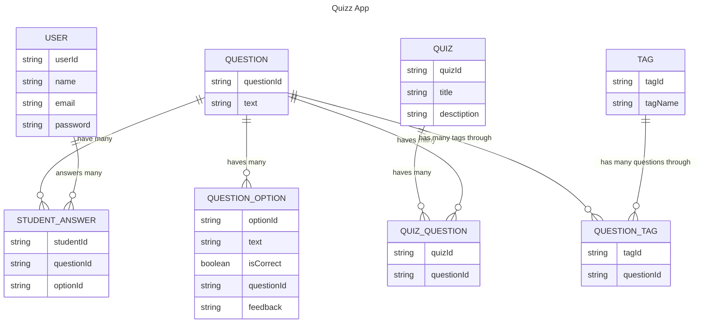

# Quizzes

A core component of the application.

Each user will have a unique ID, name, and email.

Each quiz will have a unique ID, title, and description.

Each question will have a unique ID, text, and a list of answer options.

Each answer option will have a unique ID, text, and a flag indicating whether it is the correct answer.

